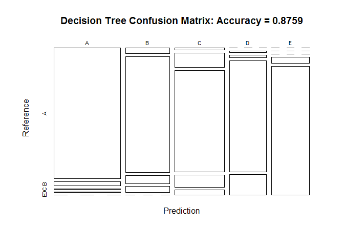
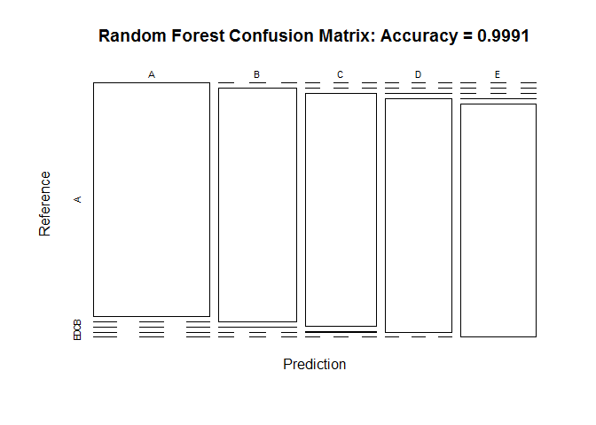
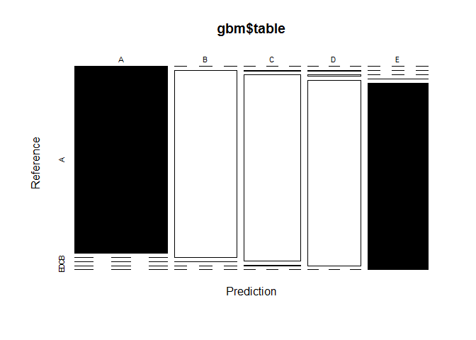

# Practical Machine Learning Course Project
Ankit Garg  
June 11, 2017  


## Background

Using devices such as Jawbone Up, Nike FuelBand, and Fitbit it is now possible to collect a large amount of data about personal activity relatively inexpensively. These type of devices are part of the quantified self movement - a group of enthusiasts who take measurements about themselves regularly to improve their health, to find patterns in their behavior, or because they are tech geeks. One thing that people regularly do is quantify how much of a particular activity they do, but they rarely quantify how well they do it. In this project, your goal will be to use data from accelerometers on the belt, forearm, arm, and dumbell of 6 participants. They were asked to perform barbell lifts correctly and incorrectly in 5 different ways. More information is available from the website here: http://groupware.les.inf.puc-rio.br/har (see the section on the Weight Lifting Exercise Dataset).

## Data

The training data for this project are available here:
https://d396qusza40orc.cloudfront.net/predmachlearn/pml-training.csv

The test data are available here:
https://d396qusza40orc.cloudfront.net/predmachlearn/pml-testing.csv

## Objective

The goal of the project is to predict the manner in which they did the excercise. We will use the training data set to come up with the prediction model, which we will then apply to the test data set


```r
library(caret)
```

```
## Warning: package 'caret' was built under R version 3.3.3
```

```
## Loading required package: lattice
```

```
## Warning: package 'lattice' was built under R version 3.3.2
```

```
## Loading required package: ggplot2
```

```
## Warning: package 'ggplot2' was built under R version 3.3.2
```

```r
library(rpart)
```

```
## Warning: package 'rpart' was built under R version 3.3.3
```

```r
library(rpart.plot)
```

```
## Warning: package 'rpart.plot' was built under R version 3.3.3
```

```r
library(RColorBrewer)
```

```
## Warning: package 'RColorBrewer' was built under R version 3.3.2
```

```r
library(randomForest)
```

```
## Warning: package 'randomForest' was built under R version 3.3.3
```

```
## randomForest 4.6-12
```

```
## Type rfNews() to see new features/changes/bug fixes.
```

```
## 
## Attaching package: 'randomForest'
```

```
## The following object is masked from 'package:ggplot2':
## 
##     margin
```

```r
library(knitr)
```

```
## Warning: package 'knitr' was built under R version 3.3.2
```

```r
library(e1071)
```

```
## Warning: package 'e1071' was built under R version 3.3.3
```

```r
library(gbm)
```

```
## Warning: package 'gbm' was built under R version 3.3.3
```

```
## Loading required package: survival
```

```
## 
## Attaching package: 'survival'
```

```
## The following object is masked from 'package:caret':
## 
##     cluster
```

```
## Loading required package: splines
```

```
## Loading required package: parallel
```

```
## Loaded gbm 2.1.3
```

```r
# Get data
set.seed(11111)

trainUrl <- "http://d396qusza40orc.cloudfront.net/predmachlearn/pml-training.csv"
testUrl <- "http://d396qusza40orc.cloudfront.net/predmachlearn/pml-testing.csv"

training <- read.csv(url(trainUrl), na.strings=c("NA","#DIV/0!",""))
testing <- read.csv(url(testUrl), na.strings=c("NA","#DIV/0!",""))

# Partition the training data set into two to build and check the validation of the prediction model
trainsub <- createDataPartition(training$classe, p=0.6, list=FALSE)
subTraining <- training[trainsub, ]
subTesting <- training[-trainsub, ]
```

## Cleaning data sets

We will now clean the data sets to rid them of the variables that will unwanted noise in the model. We will also align the class type of the variables of the testing and the training data set so that we can apply the model. I have tried to break down the process and describe with each step what I am trying to achieve

#### Removing the near zero variance variable


```r
nzv <- nearZeroVar(subTraining, saveMetrics=TRUE)
subTraining <- subTraining[,nzv$nzv==FALSE]

nzv<- nearZeroVar(subTesting,saveMetrics=TRUE)
subTesting <- subTesting[,nzv$nzv==FALSE]

# Removing the index of the training data set as that will definitely not be a variable that can be used to predict
subTraining <- subTraining[c(-1)]
```

#### Clean the variables with >= 70% NA values


```r
trainingNA <- subTraining
for(i in 1:length(subTraining)) {
    if( sum( is.na( subTraining[, i] ) ) /nrow(subTraining) >= .7) {
        for(j in 1:length(trainingNA)) {
            if( length( grep(names(subTraining[i]), names(trainingNA)[j]) ) == 1)  {
                trainingNA <- trainingNA[ , -j]
            }   
        } 
    }
}

# Set back to the original variable name
subTraining <- trainingNA

# Transforming the subtesting and testing datasets by removing the same variables that we removed from the subtraining data set
clean1 <- colnames(subTraining)
clean2 <- colnames(subTraining[, -58])  # remove the classe column
subTesting <- subTesting[clean1]         
testing <- testing[clean2]             
```

#### We will now coerce the testing data set to have the same class types as the training data set


```r
for (i in 1:length(testing) ) {
    for(j in 1:length(subTraining)) {
        if( length( grep(names(subTraining[i]), names(testing)[j]) ) == 1)  {
            class(testing[j]) <- class(subTraining[i])
        }      
    }      
}

# To get the same class between testing and subTraining
testing <- rbind(subTraining[2, -58] , testing)
testing <- testing[-1,]
```

## Predict with Model 1: Decision trees


```r
set.seed(11111)
model1 <- rpart(classe ~ ., data=subTraining, method="class")
pred1 <- predict(model1, subTesting, type = "class")
decisiontree <- confusionMatrix(pred1, subTesting$classe)
decisiontree
```

```
## Confusion Matrix and Statistics
## 
##           Reference
## Prediction    A    B    C    D    E
##          A 2150   66    9    2    0
##          B   59 1264   87   63    0
##          C   23  176 1251  147   63
##          D    0   12   21 1015  187
##          E    0    0    0   59 1192
## 
## Overall Statistics
##                                           
##                Accuracy : 0.8759          
##                  95% CI : (0.8684, 0.8831)
##     No Information Rate : 0.2845          
##     P-Value [Acc > NIR] : < 2.2e-16       
##                                           
##                   Kappa : 0.843           
##  Mcnemar's Test P-Value : NA              
## 
## Statistics by Class:
## 
##                      Class: A Class: B Class: C Class: D Class: E
## Sensitivity            0.9633   0.8327   0.9145   0.7893   0.8266
## Specificity            0.9863   0.9670   0.9369   0.9665   0.9908
## Pos Pred Value         0.9654   0.8581   0.7536   0.8219   0.9528
## Neg Pred Value         0.9854   0.9601   0.9811   0.9590   0.9621
## Prevalence             0.2845   0.1935   0.1744   0.1639   0.1838
## Detection Rate         0.2740   0.1611   0.1594   0.1294   0.1519
## Detection Prevalence   0.2838   0.1877   0.2116   0.1574   0.1594
## Balanced Accuracy      0.9748   0.8998   0.9257   0.8779   0.9087
```


```r
plot(decisiontree$table, col = decisiontree$byClass, main = paste("Decision Tree Confusion Matrix: Accuracy =", round(decisiontree$overall['Accuracy'], 4)))
```

<!-- -->

## Predict with Model 2: Random Forest


```r
set.seed(11111)
model2 <- randomForest(classe ~ ., data=subTraining)
pred2 <- predict(model2, subTesting, type = "class")
rf <- confusionMatrix(pred2, subTesting$classe)
rf
```

```
## Confusion Matrix and Statistics
## 
##           Reference
## Prediction    A    B    C    D    E
##          A 2232    0    0    0    0
##          B    0 1518    1    0    0
##          C    0    0 1366    3    0
##          D    0    0    1 1281    0
##          E    0    0    0    2 1442
## 
## Overall Statistics
##                                           
##                Accuracy : 0.9991          
##                  95% CI : (0.9982, 0.9996)
##     No Information Rate : 0.2845          
##     P-Value [Acc > NIR] : < 2.2e-16       
##                                           
##                   Kappa : 0.9989          
##  Mcnemar's Test P-Value : NA              
## 
## Statistics by Class:
## 
##                      Class: A Class: B Class: C Class: D Class: E
## Sensitivity            1.0000   1.0000   0.9985   0.9961   1.0000
## Specificity            1.0000   0.9998   0.9995   0.9998   0.9997
## Pos Pred Value         1.0000   0.9993   0.9978   0.9992   0.9986
## Neg Pred Value         1.0000   1.0000   0.9997   0.9992   1.0000
## Prevalence             0.2845   0.1935   0.1744   0.1639   0.1838
## Detection Rate         0.2845   0.1935   0.1741   0.1633   0.1838
## Detection Prevalence   0.2845   0.1936   0.1745   0.1634   0.1840
## Balanced Accuracy      1.0000   0.9999   0.9990   0.9980   0.9998
```


```r
plot(rf$table, col = decisiontree$byClass, main = paste("Random Forest Confusion Matrix: Accuracy =", round(rf$overall['Accuracy'], 4)))
```

<!-- -->

## Predict with Model 3: Generalized Boosted Regression


```r
fit <- trainControl(method = "repeatedcv", number = 5, repeats = 1)
gbmmodel <- train(classe ~ ., data = subTraining, method = "gbm", trControl = fit, verbose = FALSE)
```

```
## Loading required package: plyr
```

```
## Warning: package 'plyr' was built under R version 3.3.2
```

```r
model3 <- gbmmodel$finalModel
pred3 <- predict(gbmmodel, newdata = subTesting)
gbm <- confusionMatrix(pred3, subTesting$classe)
gbm
```

```
## Confusion Matrix and Statistics
## 
##           Reference
## Prediction    A    B    C    D    E
##          A 2232    0    0    0    0
##          B    0 1513    1    0    0
##          C    0    3 1357    4    0
##          D    0    2   10 1278    0
##          E    0    0    0    4 1442
## 
## Overall Statistics
##                                          
##                Accuracy : 0.9969         
##                  95% CI : (0.9955, 0.998)
##     No Information Rate : 0.2845         
##     P-Value [Acc > NIR] : < 2.2e-16      
##                                          
##                   Kappa : 0.9961         
##  Mcnemar's Test P-Value : NA             
## 
## Statistics by Class:
## 
##                      Class: A Class: B Class: C Class: D Class: E
## Sensitivity            1.0000   0.9967   0.9920   0.9938   1.0000
## Specificity            1.0000   0.9998   0.9989   0.9982   0.9994
## Pos Pred Value         1.0000   0.9993   0.9949   0.9907   0.9972
## Neg Pred Value         1.0000   0.9992   0.9983   0.9988   1.0000
## Prevalence             0.2845   0.1935   0.1744   0.1639   0.1838
## Detection Rate         0.2845   0.1928   0.1730   0.1629   0.1838
## Detection Prevalence   0.2845   0.1930   0.1738   0.1644   0.1843
## Balanced Accuracy      1.0000   0.9983   0.9954   0.9960   0.9997
```

```r
plot(gbm$table, col = gbm$byClass)
```

<!-- -->

## Predict on the test data set
As is evident from our models the most accurate prediction our made through random forest (Model 2), Accuracy was close to ~99.9%. Applying the model to the test data set


```r
predicttest <- predict(model2, testing, type = "class")
predicttest
```

```
##  1  2  3 41  5  6  7  8  9 10 11 12 13 14 15 16 17 18 19 20 
##  B  A  B  A  A  E  D  B  A  A  B  C  B  A  E  E  A  B  B  B 
## Levels: A B C D E
```
